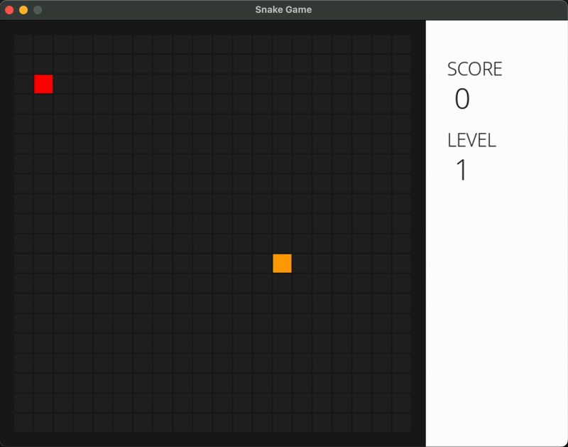

# 🐍 Snake Game with Deep Q-Learning 🧠





Welcome to the **Snake Game AI Project**! This project is a modern twist on the classic Snake game, featuring a custom Pygame implementation and an AI agent trained using **Deep Q-Learning (DQN)**. The agent learns to play Snake through trial and error — and yes, it's fun to watch! 😄

---

## 🎮 Game Overview
The Snake game is rendered with a grid-style UI using `pygame`, complete with score tracking and levels. The AI learns to play by observing the game state and taking actions like:

- `0` ➡️ Continue straight
- `1` ↩️ Turn left
- `2` ↪️ Turn right

The game environment provides feedback (rewards) based on survival, collisions, and eating food.

---

## 📂 Modes
Choose from one of three gameplay modes in `train_snake.py`:

### 1. `"play"` 👾 Manual Mode
Play the game yourself using the arrow keys!
```python
mode = "play"
```

### 2. `"train"` 🤖 AI Training Mode
Train the AI agent using Deep Q-Learning.
```python
mode = "train"
```

### 3. `"test"` 🧪 Watch the Trained Agent
Train the AI agent using Deep Q-Learning.
```python
mode = "test"
```

---

## 🛠️ How To
### ✅ Requirements
Make sure you have Python 3.7+ and install the required dependencies:
```python
pip install -r requirements.txt
```
requirements.txt:
```python
numpy
torch
pygame
```

## 🚀 Run the Game
#### 1. Train the Agent:
```python
python train_snake.py
```

#### 2. Watch the Trained Agent:
```python
# Make sure mode is set to "test" in train_snake.py
python train_snake.py
```

#### 3. Play Manually:
```python
# Set mode = "play"
python train_snake.py
```

---

## 🎓 AI Agent Overview
The agent uses a simple feed-forward neural network with the following input features:
```python
[danger_straight, danger_left, danger_right,
 food_dx, food_dy,
 dir_x, dir_y]
 ```
It gets rewarded for:
- 🍎 Eating food: +10
- ❌ Hitting walls or itself: -10
- 🐢 Taking too long: -10

The agent uses experience replay and epsilon-greedy exploration to learn effective strategies over time.

---

## 📸 Demo
Check out this animation of a trained snake navigating the grid like a champ! 🐍🔥

---

## 💾 Saving & Loading
The agent model is saved to dqn_snake.pth after training.
You can load it back in test mode to watch it play.

---

## 🧠 Bonus: Train Smarter
Modify training parameters in DQNAgent like:
- epsilon_decay
- batch_size
- gamma (discount rate)

---

✨ Future Ideas
- Add obstacles 🧱
- Add multiple agents for competition 🥊
- Use CNNs for vision-based state representation 👁️

---

## 📬 Contact
Made with ❤️ by Ali Mahdi. Feel free to reach out with questions, suggestions, or cool ideas!
